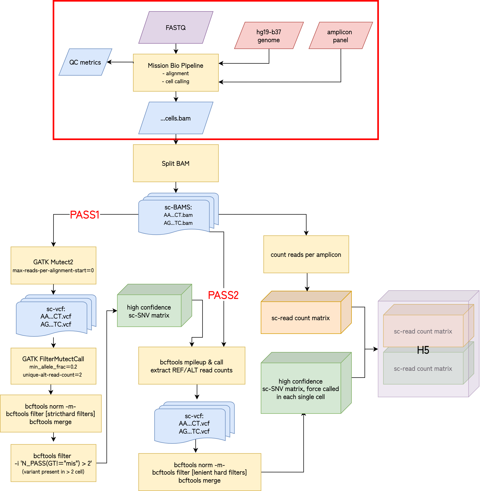

# Custom Tapestri single-cell DNA-seq data pipeline
Version 1.0.0

## Overview
### @HZ 04/2022
 
Custom single-cell variant calling workflow
-- in place of the Mission Bio Tapestri pipeline part2  
 
Key features:

- pass1: single-cell Mutect2 short variant (SNV & indel) call and filter;
- pass2: single-cell BCF genotyping to get the reference/alternate allele counts of variants called in pass1

 
 
 

## Setup:
A setup script is provided `/set_up_smk_env.sh`

## **Required inputs:**

**Outputs from MB Tapestri pipeline part1**

- single-cell BAM files:
`{sample_name}/tap_pipeline_output/results/bam/{sample_name}.cells.bam` 
 

- single-cell per-amplicon R1 count matrix:
`{sample_name}/tap_pipeline_output/results/tsv/{sample_name}.barcode.cell.distribution`
 
 

## **Final outputs:**

- single-cell barcode to numerical index map:
`{sample_name}/references/{sample_name}.barcode_map.txt`

- VCF (SNV) + per-amplicon read count (CNV) combined H5 matrices:
`{sample_name}/OUTPUT_from_mpileup/{sample_name}_DNA_CNV.h5`

- single-cell per-amplicon R1 count matrix, cell barcodes renamed to numerical indices as defined in the barcode map file above:
`{sample_name}/OUTPUT_from_mpileup/{sample_name}.per_amplicon_read_counts.tsv`

## **Runtime estimate**
For the Iacobuzio Lab PDAC panel V2 (**596 amplicons**) data (total number of reads is **450M - 600M**), given **max_jobs=3000** on the cluster, the runtime can be as low as <ins>8 hours for 8 samples</ins>, depending on cluster traffic.
